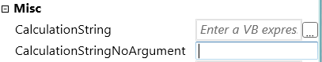

Introduction
============

In this tutorial, we provide a hands-on introduction to Developing a custom act.
You will see, the examples are simple enough even if you have never developed an
activity with Workflow Foundation before, you can learn it in no time.

In the following lessons, you will be introduced to most essential elements on
how to develop an Activity, one feature at a time. As a beginner, you should
either start with the first lesson or, if you want a very brief introduction,
take a look at the skeleton activity project. While the beginner's course will
enable you to develop a simple Activity, the skeleton Activity has example’s on
some advanced features, which are a bit harder to grasp but can take your
Activity development to the next step.

Fundamentals
============

[skeleton](./media/skeleton.png)
----------------------------------------

Activity (ViewModel)

The Activity project is the connection between the application (logic) and the
design (view) and can be called a view model. The project also contains
information for descriptions and tooltips.

Design (View)
-------------

The design project contains the visible part of the activity (view) and is
responsible for how the Activity will look in the composer. The XAML and the
code-behind-class are stored here.

Test
----

With unit tests, you can validate the functionality of the activity and helps to
avoid side effects when changes to the Activity are done in the future.

Application (Model)
-------------------

The application project contains the business logic of the Activity; this
includes interfaces to other services, databases or external systems. Therefore
it is the backend of the Activity.

Requirements for the Custom Activity
====================================

Before we start developing, we have to think about what we need the Activity to
do. You should ask yourself two central questions.

1. Input – What kind of data is at my disposal?

2. Output - What kind of data should the activity return?

Awesome Calculator – Example
----------------------------

For this tutorial we will develop the following activities:

The first activity takes a string as input, with a simple arithmetic formula of
numbers and the four basic operations (plus, minus, multiply and divided) and
will perform a calculation on it.

-   Name: CalculateFromStringActivity

-   Input: Calculation as String, e. g. 1 + 3

-   Output: The result is an integer

The second activity is also intended to perform a calculation, but this time the
values are passed directly as input.

-   Name: CalculateSimpleActivity

-   Input: Number 1 as int, number 2 as int and the calculation type should be
    selectable via a drop-down list

-   Output: The result as int

Setting up the solution
=======================

Get the skeleton
----------------

The Skeleton Activities are available on GitHub and can be downloaded either
through from the Github website or with Git from the console directly.

<https://github.com/AnotherMonday/skeleton-activities>

[./media/image4.png](./mediad/examplestructure.png)
----------------------------------------

Configuration and renaming

The first step is to rename the Solution, Project and the corresponding
namespaces to the new name. Also, rename the file
"AM.Skeleton.Activites_metadata.xml" in the activities project
(AM.Skeleton.Activities). The naming should be structured as follows: "AM.
interface/functionpackage.Activities".

Activity preparation
--------------------

We can delete the ExampleActivity.cs. And create our first activity
"CalculateFromStringActivity". Let the new class inherit from
"AbstractCodeActivity", implement the missing methods and make the class "public
sealed". Since we have already defined input and output, we add the following
variables.

CalculateFromStringActivity:

-   public InArgument\<string\> CalculationString { get; set; }

-   public OutArgument\<int\> Result { get; set; }

Proceed the same way with the second Activity "CalculateSimpleActivity". Since
we want to select the basic arithmetic operation, we need to create an Enum.
Create in your application project a new file "ElementaryArithmetic.cs" with a
public enum "ElementaryArithmetic".

CalculateSimpleActivity

-   public InArgument\<int\> NumberOne { get; set; }

-   public InArgument\<int\> NumberTwo { get; set; }

-   public ElementaryArithmetic CalculationMethod { get; set; }

-   public OutArgument\<string\> Result { get; set; }

We will discuss the use of InArgument and OutArgument later.

Unit Test
=========

Before we venture further into the application project, we need to consider test
scenarios to validate future functions. We already defined the basic framework
for our activities.

Now we create a new test class in the test project, using a public function. The
attributes above the method header are test parameters. As test parameters, we
input calculations that contain all basic arithmetic operations. As a result, we
expect the value 6 in all cases.

[TestCase("3 + 3", 6)]

[TestCase("7 - 1", 6)]

[TestCase("2 \* 3", 6)]

[TestCase("36 / 6", 6)]

[TestCase("36 / 0", 0)]

public void CalculateFromString(string calculationString, int result)

{

}

Now it's on to the function body. Since our application project should contain
the business logic, we have to create new classes and methods to enable the test
scenario to execute these. Let’s create a new interface with a function
CalculateFromString that returns the result of the calculation as int and
accepts a string with the arithmetic formula as input.

public interface ICalculatorApplication

{

int CalculateFromString(string calculationString);

}

Afterwards we create a new class, that implements the interface, with the method
CalculateFromString. Temporarily this method returns the value 0.

public class CalculatorApplication : ICalculatorApplication

{

public int CalculateFromString(string calculationString)

>   {

>   return 0;

}

}

After this is done we implement the function body of our test. First create a
new variable of the type CalculatorApplication and initialize it. Directly after
we call the CalculateFromString method and the parameters of our test, and
assign the return value to a new variable of type int.

{

ICalculatorApplication calcApp = new CalculatorApplication();

int calculationResult = calcApp.CalculateFromString(calculationString);

}

The test class should now look as follows:

[TestFixture]

public class CalculateFromStringActivityTest

{

[Test]

[TestCase("3 + 3", 6)]

[TestCase("7 - 1", 6)]

[TestCase("2 \* 3", 6)]

[TestCase("36 / 6", 6)]

[TestCase("36 / 0", 0)]

public void CalculateFromString(string calculationString, int result)

{

>   ICalculatorApplication calcApp = new CalculatorApplication();

>   int calculationResult = calcApp.CalculateFromString(calculationString);

>   Assert.That(calculationResult, Is.EqualTo(result));

}

}

All tests will fail for now when you run the unit test, since the
CalculateFromString method returns the value 0 at the moment but the test
expects a 6 as result.

Application
===========

The application project contains the business logic, related data structures,
interfaces to other services or databases.

Because we created already a functioning unit test, we can start with the
implementation of the business logic.

Since this tutorial is focused on the development of Activities we will not go
into to much detail of the CalculatorApplication implementation. See below for a
completed Implementation of CalculatorApplication.

public class CalculatorApplication : ICalculatorApplication

{

private const string ArithmeticSignPattern = \@"[\\+\\-\\\*\\/]";

public int CalculateFromString(string calculationString)

{

>   string arithmeticSignString =
>   this.GetElementaryArithmeticString(calculationString);

>   int firstNumber =

>   this.GetFirstNumber(calculationString, arithmeticSignString);

>   int secondNumber =

>   this.GetSecondNumber(calculationString, arithmeticSignString);

>   var arithmeticSign = this.GetElementaryArithmetic(arithmeticSignString);

>   return this.Calculate(firstNumber, secondNumber, arithmeticSign);

}

>   public int Calculate(int firstNumber, int secondNumber,  
>   ElementaryArithmetic elementaryArithmetic)

{

>   switch (elementaryArithmetic)

>   {

>   case ElementaryArithmetic.Addition:

>   return firstNumber + secondNumber;

>   case ElementaryArithmetic.Subtraction:

>   return firstNumber - secondNumber;

>   case ElementaryArithmetic.Division:

>   try

>   {

>   return firstNumber / secondNumber;

>   }

>   catch (Exception e)

>   {

>   Console.WriteLine(e);

>   throw;

>   }

>   case ElementaryArithmetic.Multiplication:

>   return firstNumber \* secondNumber;

>   }

>   return 0;

}

private string GetElementaryArithmeticString(string calculationString)

{

>   Regex regex = new Regex(ArithmeticSignPattern);

>   var matches = regex.Matches(calculationString);

>   if (matches.Count != 1)

>   {

>   Console.WriteLine("More than one calculation sign detected.");

>   }

>   return matches.Cast\<Match\>().FirstOrDefault()?.Value;

}

private ElementaryArithmetic GetElementaryArithmetic(string arithmeticSign)

{

>   switch (arithmeticSign)

>   {

>   case "+":

>   return ElementaryArithmetic.Addition;

>   case "-":

>   return ElementaryArithmetic.Subtraction;

>   case "\*":

>   return ElementaryArithmetic.Multiplication;

>   case "/":

>   return ElementaryArithmetic.Division;

>   default:

>   Console.WriteLine("Elementary Arithmetic sign not found");

>   return ElementaryArithmetic.Addition;

>   }

}

private int GetFirstNumber(string calculationString, string arithmeticSign)

{

>   string firstNumberString = calculationString.Substring(0,  
>   calculationString.IndexOf(arithmeticSign, StringComparison.Ordinal));

>   if (!int.TryParse(firstNumberString.Trim(), out int firstNumber))

>   {

>   Console.WriteLine("First number not found");

>   }

>   return firstNumber;

}

private int GetSecondNumber(string calculationString, string arithmeticSign)

{

>   int startIndex = calculationString.IndexOf(arithmeticSign,  
>   StringComparison.Ordinal) + 1;

>   string secondNumberString = calculationString.Substring(startIndex,  
>   calculationString.Length - startIndex);

>   if (!int.TryParse(secondNumberString.Trim(), out int secondNumber))

>   {

>   Console.WriteLine("Second number not found");

>   }

>   return secondNumber;

}

}

Now that CalculatorApplication is implemented correctly the unit test will now
pass successfully.

Activity
========

Let’s start developing an actual activity, which mediates between our business
logic and our view.

 Properties
-----------

The Composer will display all declared public properties inside an Activity; as
options in the property panel.

These can be used to pass data from the process to the activity. There are two
different types of Argument to pass data from the composer to the activity.

### Direct data type

If, for example, you create a property of type string, it is possible to pass
the desired value directly to the activity. Similar is the case with Enums,
which will create a drop-down menu with the enum's values. However, it is not
possible to pass this data to a variable that is declared inside the Composer
and vice versa.

To pass data from the composer to the activity and the other way around Workflow
Foundation provides for this case the data types In- and OutArgument.

Example: public string CalculationStringNoArgument { get; set; }

### InArguments 

The goal is to pass a variable with previously collected data from the running
process to the activity. For this, we use the generic type InArgument, which
takes the type via the angle brackets.

Example: public InArgument\<string\> CalculationString { get; set; }

Now a variable can be passed to the activity. To access the data that is being
passed in, we use the context parameter of the execute method
(CodeActivityContext context), and with the context.GetValue method we get the
desired data.

Example: string calculationString = context.GetValue(this.CalculationString);

Since we use the generic InArgument, the method GetValue returns the correct
data type.

### OutArgument

OutArgument functions the same as InArgument but as the name implies it is the
other way around. Using the context parameter, we can pass variables back to the
composer. With the method SetValue, we pass the variable from the activity to
the composer as the correct data type

-   Example: context.SetValue(this.Result, calculationResult);

Enums
-----

Enum's can be used to show drop-down inside the Composer. Enum's must be
declared directly and not as In- or OutArgument.

Attributes
----------

To control how Arguments are displayed inside the Composer, attributes can be
used before each Argument.

Here is a short list of frequently used attributes:

-   Category -\> Shows the Argument inside a specific Category on the Properties
    Panel

-   DisplayName -\> The Name the argument it should have on the Properties Panel

-   RequiredArgument -\> Indicates that the Argument needs to be set

-   VariableSelectionOutputPopup/VariableSelectionInputPopup -\>a popup will be
    displayed when dragging the activity into your workflow. This will prompt
    the user to specify a variable or enter a value directly. Highly recommended
    for required arguments

-   Description -\> A tooltip is shown when hovering over the Argument.
    Additionally, the description will be displayed inside the input box.

Metadata
--------

Instead of writing Attributes above an Argument to change how it's displayed
inside the composer you can use the AM.Skeleton.Activites_metadata.xml for this
purpose.

See the example below.

\<**ProjectMetadata**\>  
\<**Metadata**\>  
\<**ActivityMetadata ActivityType=
"AM.Skeleton.Activities.CalculateFromStringActivity"**\>  
\<**DisplayName**\>Calculate from String\</**DisplayName**\>  
\<**Description**\>Calculates a math formula from a string\</**Description**\>  
\<**Category**\>Math\</**Category**\>  
\<**SearchTags**\>calculate, math, from string\</**SearchTags**\>  
\<**PropertiesMetadata**\>  
\<**PropertyMetadata PropertyName= "Result" DisplayName= "Result"
RequiredArgument= "true" HintText= "Integer" Category="Output"
VariableSelectionInputTextPopup= "false" VariableSelectionInputVariablePopup=
"false" VariableSelectionOutputPopup= "true" Order="0"** /\>  
\<**PropertyMetadata PropertyName= "CalculationString " DisplayName=
"Calculation String" Description= "String with the math formula"
RequiredArgument= "false" HintText= "Boolean" Category="Options"
VariableSelectionInputTextPopup= "false" VariableSelectionInputVariablePopup=
"false" VariableSelectionOutputPopup= "true" Order="1"** /\>  
\</**PropertiesMetadata**\>  
\</**ActivityMetadata**\>  
\</**Metadata**\>  
\</**ProjectMetadata**\>

Synchronous Activities
----------------------

Most common Activites are Synchronous. Your type should inherit from
AbstractCodeActivity or from a type that does. AbstractCodeActivity contains an
abstract method that you need to overwrite. To pass Arguments into your business
logic, you have to use context.GetValue(). After processing the value, you can
then return it to the composer via context.SetValue().

See example below.

protected override void Execute(CodeActivityContext context)

{

string calculationString = context.GetValue(this.CalculationString);

Console.WriteLine(calculationString);

ICalculatorApplication calcApp = new CalculatorApplication();

int calculationResult = calcApp.CalculateFromString(calculationString);

context.SetValue(this.Result, calculationResult);

}

You should add error handling to the activity to show for example when arguments are left empty. See 7.7 for details.
---------------------------------------------------------------------------------------------------------------------

Async Activites
---------------

If you have a long-running task its best to run it on a separate thread, after
the task is complete, you can use the type AbstractTaskAsyncCodeActivity.

If your task needs to return a value, you need to use the type
AbstractTaskAsyncCodeActivity\<T\>

See Async without result Example below:

**public class** AsyncActivity : AbstractTaskAsyncCodeActivity  
{  
**public** InArgument\<**string**\> **FilePath** { **get**; **set**; }  
**private static async void** HandleFileAsync(**string** file)  
{  
*/// Long running task*  
}

  
**protected override** Task ExecuteAsync(AsyncCodeActivityContext context,
CancellationToken cancellationToken)  
{  
**string** file = **FilePath**.Get(context);  
  
**return** Task.**Factory**.StartNew(() =\> HandleFileAsync(file),
cancellationToken);  
}

}

For an Async with result example take a look inside the Skeleton Activity

Error handling
--------------

To add error handling to the activity, the method CacheMetadata(
CodeActivityMetadata metadata ) must be overridden to add a custom error
messages or warnings inside the Composer

Error message example below:

**protected override void** CacheMetadata(CodeActivityMetadata metadata)  
{  
**base**.CacheMetadata(metadata);  
**if** (**CalculationString** == **null**)
metadata.AddValidationError(**"Argument CalculationString has not been set."**);  
}

Warning message example below:

**protected override void** CacheMetadata(CodeActivityMetadata metadata)  
{  
**base**.CacheMetadata(metadata);  
**if** (**CalculationString** == **null**)  
{  
ValidationError validationWarning = **new** ValidationError(**"Argument
CalculationString has not been set."**, **true**);  
metadata.AddValidationError(validationWarning);  
}  
}

Write logs
----------

To write to logs from your activity, you need to use the class
AM.Logging.LogHelper

The log levels you can use are the following.

LogLevel.Debug

LogLevel.Info

LogLevel.Warn

LogLevel.Error

Usage example below:

**try**  
{  
*// Error here*  
}  
**catch** (Exception ex)  
{  
LogHelper.Error(ex.ToString());  
**throw**;  
}

Design
======

TBD.

Deployment
==========

To use your activity, you have to compile the solution and copy the resulting
DLLs into the Libraries folder in the composer. For our activity these are the
following files:

-   AM.AwesomeCalculator.Activities.dll

-   AM.AwesomeCalculator.Application.dll

If you have included external libraries in your activity, they must also be
copied.

Composer usage
==============

TBD.
